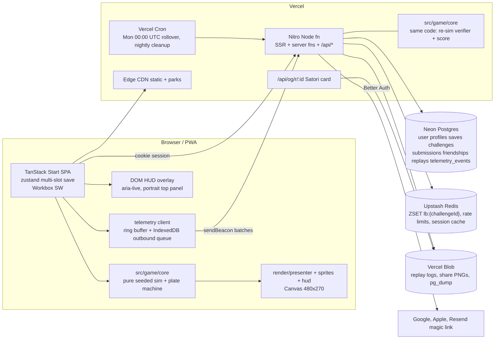

# Studio circle-up #4 — Retro Diamond: the finished product

**Date:** 2026-09-03 (morning)  
**Charge:** "Circle up the studio and review. Plan the full build-out of each facet of the game. Plan the finished product down to every detail."  
**Attendees:** Game Designer, Systems, UX, Economy, Live-Ops, Analytics, Art Direction + Engine Tech, Platform/Backend. Creative Director synthesis in this doc. Circle-ups #1–#3 still bind except where this doc explicitly reopens a lock.  
**Owner decisions taken before this doc:** (1) finished = polished offline career **plus a social layer** (accounts, cloud save, friends, leaderboards, shared weekly seed challenge, replay share); no real-time multiplayer. (2) New art is produced **in-pipeline**: AI-generated, then cleaned to the sheet spec. (3) Hosting: assistant's recommendation, growth in mind → **Vercel + Neon + Upstash + Blob** (validated by Platform). (4) **Free, nothing sold.** Cosmetics unlock by play only. (5) **Vercel is production.** Grok gate-identity plugin is removed in 1.0; the sandbox popup/middleware stays only until Vercel previews are live.  
**Verdict:** **GO.** The game has a real loop (30 s PA → 9-inning game → 18-week season → offseason). What separates it from finished is (a) consequences the player controls between the pitch and the box score, (b) a career with texture between seasons, (c) a presentation layer that reads on a 360 px phone, and (d) a deterministic core that lets the same code verify a shared weekly challenge. Everything below is sequenced so that the deterministic core lands first, because it is the one thing that cannot be retrofitted cheaply.

---

## 1. Executive verdict

Eight lanes reviewed the same inventory and converged on five structural moves:

1. **One simulation, run everywhere.** Retire the inning-run painter in `simFullGame`. Every game, live or simmed, is a sequence of plate appearances resolved by `pickPitch → swing decision → resolveContact → applyPlay`. User inputs (timing error, aim cell, delivery misses) plug into the same functions the CPU uses. A 16-team season at PA level costs < 20 ms, so box scores become real for free. (Systems)
2. **Decisions where there were rollouts.** Runners are currently accounting entries. Add one-tap SEND/HOLD interrupts during the existing ball-flight animation, a pre-pitch STEAL flag, and a lightweight manager layer (pinch hit, bullpen/mound visit, IBB, shift, game plan). Fielding stays auto-resolved. (GD, UX)
3. **A career that remembers.** Age curves per rating family, contracts with extensions and arbitration-lite, CPU clubs that bid in free agency, scouting noise on the draft, a facilities tree and coaching staff as the long-arc sinks, owner objectives, a records book, Hall of Fame, rivalries, milestones, and a job market when you are fired. (GD, Economy, Live-Ops)
4. **A presentation that scales.** Canvas keeps field, actors, ball, zone, grids, meter, pops. Text HUD moves to a DOM overlay (a11y, 320 px legibility) and fills the portrait dead space above the canvas. New sheets for batter, pitcher (3/4 front, LHP mirror), fielders, runners, catcher mitt, umpire, crowd, weather, 48 park relights. Palette-LUT tinting replaces the pixel heuristic. Chip sequencer music and a continuous crowd model. (Art + Engine, UX)
5. **A deterministic core with a thin server.** `src/game/core` is pure and seeded (per-PA RNG streams). Input logs are frame-indexed. The server re-simulates challenge submissions with the same code, owns the score, and keeps leaderboards in Redis. Guest-first identity via Better Auth's anonymous plugin; cloud save is a CAS protocol with a choose-one conflict UI. (Platform, Systems, Analytics)

**Reopened locks:**
- Circle-up #1 killed playable fielding. **Stays killed.** Baserunning decisions are reopened as timed interrupts, not a minigame.
- Circle-up #2 rejected a catcher because it covers the zone. **Reopened as mitt-only:** a 64 px mitt+forearm that *is* the target ring during `call`, receives at the actual location, then drops out. Full ghost body at 35 % alpha is a Settings option.
- Circle-up #1 locked "meter stays on canvas." **Holds.** Only text HUD moves to DOM.
- Circle-up #1 locked no live-service treadmill / no FOMO. **Holds and tightens:** nothing is sold; every cosmetic is unlockable by play; the only engagement-linked credit remains `LIVE_BONUS = 1`.

---

## 2. Lane verdicts

| Lane | Verdict | Line |
|---|---|---|
| Game Designer | GO | "Runners are accounting entries. Make them decisions inside the animation you already have." |
| Systems | GO | "Delete the painter. `applyPlay` already credits real stats; the fast sim just has to call it." |
| UX | GO | "The portrait play screen wastes 294 px above the canvas. Fill it with the information the player is memorizing." |
| Economy | GO | "Credits should always be spoken for. Today training is the only recurring sink and the stadium is done by season 4." |
| Live-Ops | GO | "Earned cliffhangers, not timers. A 3-inning Late & Close finishes in 10 minutes; a 9-inning challenge does not." |
| Analytics | GO | "`game.live.pa_resolved` feeds nine of the ten balance charts. Ship that event first." |
| Art + Engine | GO | "Prove the pipeline on the hardest tint case (fielders), then the plate, then everything decorative." |
| Platform | GO | "Determinism is the only item that cannot be retrofitted. 1 → 5 → 6 is the critical path." |

---

## 3. Where the lanes disagreed, and the call

| Question | Positions | Call |
|---|---|---|
| Difficulty tiers | GD: 4 (Rookie/Amateur/Pro/Legend). Systems, Economy: 3. | **3: Rookie / Pro (default) / Legend.** Systems owns the multipliers (user-side only); Economy owns the budget knobs. Difficulty is a career-start choice. |
| Weekly challenge format | GD: 3-inning game, fixed All-Star roster, points formula. Live-Ops: rotating scenario library, "Late & Close" 3-inning default, outcome-first scoring. Systems: `runs×100 + hits×10 + TB×5 − K×2`. Platform: points → fewer pitches → earlier. | **Scenario library (12), fixed rosters, seed = HMAC(secret, isoWeek).** Score (server-owned, `core/score.ts`): `outcome (win 300 / tie 100 / loss 0) + runDiff×50 + hits×10 + TB×5 − K×2`, clamped ≥ 0. Tie-break: fewer pitches thrown, then earlier. Best-of, max 3 attempts per week. Pro difficulty. Assists (AUTO-PITCH, AUTO-BASERUN, timing assist) are allowed but the entry lands on the **Assist board**, not the main one. |
| Challenge brackets | Live-Ops: Rookie/Veteran/Legend by career grade. | **1.0: one main board + Assist board + Friends filter.** Legend-tier 9-inning "Sunday Classic" is a monthly board in 1.1. |
| Telemetry default | Analytics: existing anonymous toggle on by default, DNT/GPC respected. Live-Ops: off by default for anonymous users. | **Anonymous aggregate telemetry on by default**, first-run notice with a one-tap OFF, DNT/GPC → off, account-linked telemetry opt-in. Reason: the plate cannot be tuned without `pa_resolved`, and anonymous events carry no PII by construction (§12). |
| Cosmetic store | Live-Ops proposed a store with a 30-day permanent-pool rule. | **No store. Nothing sold.** All kits, park skins, badges and patches unlock via milestones, challenge finishes and community targets. The 30-day rule is moot; the "nothing disappears" rule stays. |
| Routing | UX: hybrid. Platform: real routes for share surfaces. | **Hybrid.** Manager loop stays Zustand `screen` state. Real TanStack routes: `/challenge`, `/challenge/$week`, `/leaderboard`, `/profile/$code`, `/r/$id`, `/f/$code`, `/help`. |
| Friend code | UX, Live-Ops: 6 chars. Platform: 8 Crockford base32. | **8-char Crockford base32** (≈1e12 space, regenerable). |
| Scouting | GD: letter grades for CPU players, hidden draft ratings. Economy: Scouting Dept facility reveals potential. Systems: `scoutedPotential` with σ = 3.5 − level. | **One system.** CPU players show letter grades (A–D) unless scouted. Draft shows `scoutedPotential`; σ by scouting level 1–3 (2.5 / 1.5 / 0.5). Level 1 is free; per-pick spend 1C / 2C buys level 2 / 3; the Scouting Dept facility makes level 3 free. Advance scout (1C, pre-game) reveals 3 opposing heat maps. |
| Coaching staff | GD: 3 staff at 3C/season. Economy: 4 coaches on 2-year contracts. | **Economy's model.** GD's Trainer becomes the Medical Wing facility. |
| Taxi squad vs Academy | GD: 3-slot taxi squad. Economy: Academy facility (+1 draft pick). | **One facility, "Academy":** grants the 3 taxi slots (off-roster, off-cap, full development rate) and +1 draft pick. |
| Career length | GD: 20-season hard cap. Live-Ops: 10-season dynasties as story. | **No hard cap.** Hall of Fame eligibility and legacy tiers evaluate continuously; Commissioner Mode unlocks after 3 rings. |
| Injury → potential | GD: Break type → potential −1; > 6 career injured weeks → speed −1. Systems: potential −1 if > 4 injured weeks in a season. | **Systems' rule** (> 4 weeks in a season → potential −1) plus GD's three injury types and IL choice. Medical Wing heals 1 week faster. |
| Extra innings | GD: uncapped. Existing: 18 live / 13 sim with forced resolution. | **Keep existing caps** (tests exist; a game must end). |
| Fixed cam vs cut-scene camera | Art: keep the catcher cam; add a 0.6 s HR "zoom punch." | **Fixed cam.** Baserunning is drawn in-camera via `groundPoint`. |

---

## 4. Locked principles (carry-forward and new)

1. The plate is the star. Every new mechanic is an interrupt or a pre-pitch choice; none competes with the timing tap.
2. One-tap fallback for every input; no simultaneous motor tasks; default on timeout is the conservative choice.
3. Symmetry: the CPU uses the same functions as the user. Difficulty scales user-side constants only; CPU-vs-CPU is never touched.
4. Determinism: `src/game/core` has no DOM, no `Date`, no `performance`, no `Math.random`, no libm-dependent `Math.*` (`pow/exp/log/sin/cos/tan/atan2`). Fixed 60 Hz ticks. Per-PA seeded RNG streams.
5. Offline-first. Single-player never touches the server. Sign-in gates only cloud save, ranking and sharing.
6. Nothing sold, nothing sunsets, no timers on content, no coercive copy. Anonymous by default.
7. The voice is a retired sportswriter: dry, past tense for outcomes, present tense for prompts, no exclamation marks in UI.

---

## 5. Architecture

Module boundary (enforced by ESLint `no-restricted-imports` / `no-restricted-globals` / `no-restricted-properties`):

| Module | Owns | Node-testable |
|---|---|---|
| `src/game/core/rng.ts` | `makeRng` (legacy LCG kept for identity hashes), `stream(seed, label, paIdx)` mulberry32; streams `pitchSelect`, `scatter`, `contact`, `fielding`, `cpuDecision`, `league`, `fx` | yes |
| `src/game/core/plate-machine.ts` | `step(state, input, rng): state` for intro/call/windup/pitch/result/sideover/over; runner plans; fx event queue | yes |
| `src/game/core/{sim,plate,field-geometry,career,economy,generate,roster,score}.ts` | everything that decides outcomes; `SIM_VERSION` | yes |
| `src/game/core/identity.ts` | `ensureLook`, `effectiveBats`, `kitFor` (split from `look.ts`) | yes |
| `src/game/render/{presenter,sprites,hud}.ts` | particles, hitstop, trauma, camera punch, actor depth sort, LUT tinting, byte-bounded cache, canvas HUD remnants | golden frames |
| `src/game/input.ts` | pointer/keyboard → `Action` with tick stamps; recorder | yes |
| `src/game/replay/{recorder,shareCard}.ts` | log capture, headless playback, card composition | yes |
| `src/game/engine.ts` | thin facade so `Play.tsx` keeps its API | — |

---

## 6. Live game completeness

Treatment legend: **Auto** = pre-rolled, visual only · **Decision** = one tap · **Skill** = timing/location mechanic applies.

| Element | Treatment | Rule | Hook |
|---|---|---|---|
| Steal / caught stealing | **Decision** (user), Auto (CPU) | Pre-pitch `STEAL` toggle when runner on 1st/2nd and `speed ≥ 8`. `sbSuccessP = clamp(0.70 + (speed − catcherArm)/20 × 0.28, 0.50, 0.92)`. CPU attempts `sbAttemptP = clamp(speed/20 × 0.18 − catcherArm/20 × 0.07 − 0.04, 0.02, 0.20)` when trailing by ≤ 2 or ahead late. `sb`/`cs` stats increment. | `applyPlay`, new `attemptSteal` |
| Pickoff | Auto | `pickoffP = clamp(control/20 × 0.04, 0.004, 0.035)` when a steal is flagged. | `applyPlay` |
| HBP | Auto | Per pitch when `!inZone && locOut > 1.8`: `hbpP = clamp(0.006 + (1 − control/20) × 0.008, 0.002, 0.016)`. Fast path: `0.009 − control/20 × 0.005`. Reaches, no AB. Banner `HIT BY PITCH`. | `cpuPA`, plate machine |
| Wild pitch / passed ball | Auto | With runners or K in dirt: `wpP = clamp((1 − control/20) × 0.045, 0.004, 0.06)`, `pbP = clamp((1 − catcherFielding/20) × 0.025, 0.003, 0.04)`. Runners +1; dropped third strike reaches. | `applyPlay` |
| Errors | Auto | Per BIP: `errorP = clamp((1 − fielding/20) × 0.09, 0.005, 0.12)`; FB/LD × 0.45. Batter reaches, `e` charged, runners +1 extra. | `applyPlay`, `defenseFactor` |
| Batted-ball type | Auto | `batType` on `PlayResult`: `quality < 0.35 → GB; locRatio > 1.2 → PU; quality > 0.7 → LD; else FB`. Replaces label regexes. | `resolveContact`, `types.ts` |
| Double play | Auto | `dpEligible = batType === "GB" && b1 && outs < 2`; `dpChance = clamp(0.40 − speed/20 × 0.14 − (quality − 0.5) × 0.55, 0.08, 0.48)`. Target ≈ 0.8 DP/game. | `applyPlay` |
| Extra-base advancement | Auto (CPU) / **Decision** (user, §7) | `advance1to3P = clamp(0.08 + (speed − OFarm)/20 × 0.30, 0.04, 0.55)`, `advance1homeP = clamp(0.28 + (speed − OFarm)/20 × 0.38, 0.10, 0.68)`. | `applyPlay` hit branches |
| Tag-up / sac fly | Auto | FB out, runner on 3rd, < 2 outs: `tagSuccessP = clamp(0.52 + (speed − OFarm)/20 × 0.32, 0.28, 0.88)`; 2nd → 3rd only. | `applyPlay` |
| Infield fly | Auto | `batType === "PU" && b1 && b2 && outs < 2` → batter out, runners hold, banner `INFIELD FLY`. | `applyPlay` |
| Sacrifice bunt | **Decision** | Existing BUNT swing with runner on and < 2 outs: runner advances, batter out unless speed roll. | `resolveBunt`, `applyPlay` |
| Intentional walk | **Decision** (defense) / Auto (CPU) | `IBB` button in `call`. CPU: `power ≥ 15 && contact ≥ 12`, base open, inning ≥ 7, lead ≤ 1. | HUD, `cpuPA` |
| Pinch hitter | **Decision** | `PINCH HIT` card at PA start when bench available; limit 2/game; no re-entry. | `LiveGame`, HUD |
| Defensive sub | **Decision** | After the 6th, one swap from bench. | HUD |
| Bullpen / mound visit | **Decision** | `BULLPEN` in `call` shows relievers with energy/grade; `VISIT` restores +5 energy, 1 per pitcher per game. `maybeBringCloser` remains the auto path. Consecutive-day relievers: `effectiveEnergy = min(energy, 100 − 20)`. | `sim.ts`, HUD |
| Defensive shift | **Decision** | Pre-inning toggle vs pull hitters (`power − contact > 4`): GB out +8 %, LD stop −5 % in `defenseFactor`; fielders nudge on canvas. CPU shifts vs sluggers. | `defenseFactor`, `field.ts` |
| Platoon | Auto | Opposite-hand matchup +1 effective contact; shown in Lineup as opponent SP handedness. | `resolveContact` input |
| Weather / time | Auto | `GameConditions {time: day|dusk|night, weather: clear|wind|rain, wind ∈ [−0.6, 0.6]}` seeded per slot. `windHr = 1 + wind × 0.10`, `windDbl = 1 + wind × 0.06`; rain adds WP bonus. Banner at game start only. | `simFullGame`, backdrop |
| Mercy rule | Rejected | One game a week; never mercy. | — |

---

## 7. Baserunning decisions and the manager layer

**Runner decision card.** When a batted ball goes to the outfield with a runner on 2nd or 3rd, a `[HOLD] ◄── timer ──► [SEND]` card appears in the button bar for the duration of the existing flight animation (tie the timer to `planFlight` duration; if the flight shortens, the timer shrinks). Timer: Rookie 2.0 s · Pro 1.2 s · Legend 0.8 s. Default on timeout: HOLD. Multi-runner: 3rd first then 2nd, total ≤ 2.0 s. Keys: `S`/`H` or ←/→. Outcome uses the same `advance*P` formulas as the CPU. `AUTO-BASERUN` in Settings always holds. CPU baserunners use `cpuBaserun(runner, batType, OFarm)` with the same formula and take risks when trailing by 2+ from the 7th.

**In-game decisions** (defense in `call`, offense in `intro`): Steal · Bunt · IBB · Pinch hit · Bullpen/Visit · Shift · Send/Hold. Each replaces one slot in the 4-button bar for one PA or is a banner card above it; every target ≥ 44 px CSS; sticky toggles survive a pitch.

**Pre-game decisions (Office):** Rotation rest (energy < 40 auto-rest; override at ×0.7 stamina) · Platoon lineup (opponent SP handedness shown) · Advance scout (1C, 3 heat maps revealed in HUD) · Game plan radio: Aggressive (steal +15 %, bunt −15 %) / Normal / Defensive (steal −15 %, free shift).

---

## 8. Unified simulation and calibration

`simFullGame` body → `while (!live.over) live = simHalfInning(career, live)`; `paintSimStats` deleted; `liveToGameResult` added. `simCpuPa`'s `Math.random` → seeded stream. `Player` gains `pitchedLastGame`, `totalInjuredWeeks`, `scoutedPotential`.

**League targets** (16 teams, seeded season fuzz; test #28):

| Stat | Target | Tol | Knob |
|---|---|---|---|
| BA | .255 | ±.012 | `singleP` |
| OBP | .322 | ±.015 | `bbP` |
| SLG | .415 | ±.018 | `hrP × power` |
| K % | 22 % | ±2 | `kP` |
| BB % | 8 % | ±1.5 | `bbP` |
| HR/PA | 3.0 % | ±0.5 | `hrP × 0.22` |
| SB att/game | 1.1 | ±0.3 | `sbAttemptP` |
| SB % | 72 % | ±5 | `sbSuccessP` |
| ERA | 4.20 | ±0.35 | `kP` stuff coefficient |
| R/game | 4.5 | ±0.5 | park neutral 1.0 |

Archetypes (650 AB / 180 IP): contact hitter (17/10/13) .305, 14 % K, 10 HR · power bat (11/18/10) .242, 28 % K, 42 HR · speedster (13 contact, 18 speed) .278, 38 SB · balanced 10s .252 / 22 % / 16 HR · ace (17/16/15) 3.20 ERA · average SP 4.50 · closer (14/11/6) 3.50.

**Difficulty (user-side only):**

| Tier | Timing window | Barrel radius | CPU scatter σ when user pitches | CPU eye weight | Runner timer |
|---|---|---|---|---|---|
| Rookie | ×1.80 | ×1.50 | ×0.65 | −0.10 | 2.0 s |
| Pro | ×1.00 | ×1.00 | ×1.00 | 0 | 1.2 s |
| Legend | ×0.65 | ×0.78 | ×1.30 | +0.10 | 0.8 s |

Timing assist (accessibility) widens the user window by 30 % independent of tier and flags the session `assist`.

**Performance budget:** full season + playoffs ≈ 9,900 PA / 34,650 pitches / 624k RNG calls, < 20 ms. Hot-path rules: object literals only, no `Math.random`, `simHalfInning` 40-iteration guard stays.

---

## 9. Career depth

**Age curves** (per offseason, per rating family; `Δ = ageCurveDelta × potentialRoom × N(1, 0.4) + trainingBonus`, `potentialRoom = clamp((potential − current)/8, 0.05, 1)`, playing time < 50 % of weeks → ×0.5, > 4 injured weeks in a season → potential −1):

| Family | Rise | Peak | Plateau end | Decline |
|---|---|---|---|---|
| Speed | +0.9 | 24 | 28 | −1.3 |
| Power | +0.6 | 27 | 31 | −0.7 |
| Contact | +0.5 | 28 | 32 | −0.55 |
| Eye | +0.3 | 29 | 33 | −0.45 |
| Fielding | +0.3 | 26 | 32 | −0.55 |
| Arm | +0.15 | 26 | 32 | −0.4 |
| Stuff | +0.5 | 26 | 30 | −0.65 |
| Control | +0.4 | 28 | 34 | −0.4 |
| Stamina | +0.2 | 27 | 32 | −0.7 |

Training grants `+0.3` to the trained attribute's growth roll; training a declining attribute costs 8C and freezes its decline for a season. SP with ≥ 3 seasons gains a 5th arsenal option.

**Contracts.** `salary = max(2, round(ovr × 1.8 × agingFactor × posFactor + years × 0.4))`; `agingFactor` 1.25 (≤ 23) / 1.0 / 0.88 (31–33) / 0.75 (≥ 34); `posFactor` SP/CL 1.15, C 1.10. Years 1–2 pre-arb; arbitration-lite raises +2 salary for `years == 1 && ovr ≥ 14`. Extension before the final year: `cost = max(2, floor((ovr − 10)/2))` credits, locks 2 more years at +10 %. Unextended → FA. **CPU FA bidding:** in `runOffseason` CPU clubs claim up to 2 FAs each in prestige order, salary ≤ `prestige × 12`, filling their weakest position. Retirements clear salary. Trade deadline weeks 12–13 relaxes `tradeRefusal` from −6 to −4. Trade AI values `surplus = ovr − salary × 0.5` and refuses deals costing it > 3.

**Scouting and draft.** Pool of 24 seeded on `year`; snake draft, worst record first; `scoutedPotential = clamp(round(potential + N(0, σ)), 1, 20)` with σ 2.5 / 1.5 / 0.5 by level; bottom-4 clubs get 2 extra picks; Academy adds 1.

**Injuries.** Per game `p = 0.004 + 0.002 × (age − 25)/10 + 0.003 × lowEnergyGames`. Types: Strain 1–2 wk (energy cap 60) · Pull 3–5 wk (out) · Break 6–10 wk (out). User chooses IL (frees roster slot) or play-through. Rehab training −1 week. Medical Wing −1 week.

**Morale and chemistry.** `morale` 1–10: < 4 → growth ×0.7; < 3 → −1 effective contact/power (gray chevron). Drivers: +1 per 3-game win streak, −1 per 3-game skid, bench −1/month, positive press +1 to one player, contract-year unextended −1. Team average ≥ 7 → hidden +1 eye for all hitters, badge `LOCKED IN`.

**Rivalries.** `career.rivalries[teamId] = {wins, losses, heat}`; heat rises with playoff meetings, late-season eliminations, and margin; ≥ 60 = rivalry (banner, +2 owner on win, fans +3); decays 5/season without a playoff meeting.

**Records, Hall of Fame, legacy.** `career.records` single-season and career, franchise and league, all breakable. HoF: ≥ 5 seasons and thresholds (200 HR or WAR-equivalent ≥ 35); one induction news item per offseason; retired numbers removed from that club's generator. Legacy tiers: Footnote · Lifer · Builder (bronze plaque) · Legend (gold plaque, park banner) · **Dynasty** (≥ 2 rings and ≥ .600, dynasty timeline). Three rings unlock Commissioner Mode (no owner pressure).

**Job market.** On firing, the manager is hired by the lowest-prestige club without a recent ring; credits reset to 10; stadium inherits. Career continues.

---

## 10. Economy

Single currency (credits). `marketTier = ceil(prestige/2)` (1–3).

| Faucet | Formula |
|---|---|
| Game | `base (win 4 / loss 2) + live 1 + gate` where `gate = home ? (stadium − 1) × marketTier + (fans ≥ 70 ? marketTier : 0) : 0` |
| Star power | home: `min(4, count(ovr ≥ 15)) × marketTier × 0.5` |
| Ticket tier (set per season) | Discount ×0.75 gate (+1 fans on wins, −1 on losses) · Standard · Premium ×1.30 (−1 / −2) |
| Broadcast (season end) | `marketTier × (2 + floor(wins/4))`, capped `marketTier × 6` |
| Revenue sharing | +6C if broadcast < 5C |
| Owner | objective met +4–8C; backed ≥ 75 +6C; ring +12C |

| Sink | Cost / rule |
|---|---|
| Training | 4C (3C Rookie, 5C Legend); per-player season cap `3 + (potential − ovr)` |
| FA sign | 1C (2C Legend) |
| Trade | 2C |
| Stadium | `6 + 4 × level`; upkeep `(stadium − 2) × 2C` per season from level 3 |
| Luxury tax | `floor((payroll − 180)/10)` per offseason (Rookie threshold 200, Legend 160) |
| Extension | 2–5C |
| Facilities | Training Complex I 12C (train 3C) · II 22C (train 2C) · Medical Wing 15C · Scouting Dept 18C · Academy 28C (+1 pick, 3 taxi slots) · Video Room 20C (+1C per live win). Total 115C over a dynasty. |
| Coaching (2-year contracts) | Hitting 8C (+1 contact on field) · Pitching 8C (+1 stuff) · Development 10C (+15 % growth ≤ 25) · Bench 6C (+2 morale on wins) |

Budgets (all games played, Pro): bad small-market ≈ 52C earn / 35C spend · average ≈ 92 / 65 · good ≈ 130 / 95 · dynasty ≈ 155 / 120. Buffer 25–35C is intentional.

**Owner objectives** (one per season, shown at season start): Make playoffs +12 / −15 · Win the ring +20 / −18 · Develop 2 rookies to ovr ≥ 12 +8 / −5 · Break even +5 / −3 · Win the rivalry series +6 / −4. Firing threshold `10 + (5 − prestige) × 3`; hot seat loses a pick.

Difficulty: starting credits 20 / 8 / 4. Weekly challenge has no economy (fixed roster, stadium 3).

---

## 11. Progression and career memory

- **Season objectives** (§10) replace the raw owner swing at season end.
- **Milestones** (`career.milestonesHit`, each once): coaching wins 10/25/50/100/200; player HR 10–50; pitcher K 50/100/200; streaks 5/8; rings 1/2/3; undefeated week; shutout; cycle; CPU perfect game. Each a badge in Legacy/Office.
- **Season arc** (5 templated sentences in `data.ts`: opening, midpoint wk 9, stretch wk 13, playoff rounds, epitaph) shown in the **Yearbook** screen (offseason → yearbook: record, awards, moments, records broken, draft, headline).
- **Return hooks** in `sessionHook` → `{copy, hookType}`: pennant race, clinch/elimination, contract year, rival week, breakout alert, imminent milestone, final. Telemetry `hook.shown`.
- Endgame: first ring → Builder floor and gold ring badge; three rings → Legend + Commissioner Mode; five rings → statue banner.

---

## 12. Social layer

**Identity.** Guest-first. First server-touching action calls Better Auth `signIn.anonymous()`. Upgrade via Google, Apple (1.1), or Resend magic link; `anonymous.onLinkAccount` re-parents saves/submissions/replays/friendships in one transaction, keeping the higher `rev` per slot. Mount `src/routes/api/auth/$.ts`. `__Host-` cookies, `SameSite=Lax`, 30 d sessions, anonymous 90 d, idle anonymous users purged at 180 d. Better Auth rate limits and secondary storage on Upstash. Remove `gate-identity.server.ts`, `gate-session.server.ts`, their test and `GATE_PROVIDER_ID`; keep the Grok popup path behind `GROK_AUTH_CLIENT_ID` for the sandbox until Vercel previews are live (1.1 removes it). Account deletion: Blob cleanup, `ZREM`, cascade; `exportMyData` first.

**Cloud save.** Local store → multi-slot (`SAVE_VERSION 7`: `{activeSlot, slots[3], settings}`). Fresh career measures 205 KB raw / 20 KB gzip; cap 512 KB compressed. Client gzips via `CompressionStream`, hashes raw JSON (`sha256`); server re-hashes, stores `blob BYTEA` + `summary JSONB`, never migrates blobs (`migrateSave` runs client-side on pull). CAS on `rev`; conflict → modal `Y1993 W7 · 41-23 · 1 ring · iPhone · 2h ago` vs cloud, choose one, loser to `saves_backup`. Push after week/game/offseason/retire/new/reset, debounced 2 s, never mid-live-game. Export `.rdsave`, import with zod + migrate. Quotas 60 pushes/h, 2 MB/h.

**Weekly challenge.** Cron `0 0 * * 1` closes the week, snapshots top 1000, opens the next with `seed = HMAC(CHALLENGE_SEED_SECRET, isoWeek)` and `sim_version`. Scenario library (rotating): Late & Close (tie, T8, 3 inn) · Down Two B7 · Protect the Lead (1 inn, closer) · Extra-Innings Walk-Off · Bases Loaded No Outs · Perfect Game Watch · Sunday Classic (9 inn, 1.1 monthly) · September Call-Up · Comeback Kids (down 3, B6) · No-Hitter Broken Up · Series Decider · Winter Classic (holiday park, December). Fixed rosters; `gameSeed = HMAC(challenge.seed, userId)` so copied logs cannot reproduce another player's score. Input log v1 (one event per pitch, frame-indexed): `["o", aimCell, swing, swingFrame]`, `["d", pitchIdx, targetCell, delivery, kickFrame, relFrame]`, `["a"]`, `["s"]`; ≤ 2000 events, ~1.5 KB gzip. Server `replayGame` → `verified | mismatch | invalid`; `SIM_VERSION` mismatch rejected; core changes deploy only at rollover (CI blocks `SIM_VERSION` bumps without the `rollover` label). Offline: challenge payload cached at session start; late submissions recorded as completed, unranked. Rewards: Challenger badge · top 100 silver foil · top 10 gold foil + park banner · #1 named trophy in the yearbook · 4 weeks completed → "Diamond Circuit" patch.

**Leaderboards.** Redis `ZSET lb:{challengeId}`, member `userId`, packed score `points × 1e10 + (9999 − pitches) × 1e6 + (999999 − secondsSinceOpen)`, `ZADD GT` for best-of; Postgres `submissions` is truth with `rebuildLeaderboard`. Boards: weekly (verified), assist (verified, flagged), legacy and season (honor, badge "unverified" until seeded careers in 1.1). Friends filter via `ZMSCORE` on ≤ 200 ids. `UNIQUE(challenge_id, user_id)`; 10 submits/h/user. Display names 3–16 `[A-Za-z0-9_]`, obscenity filter, reports table, flagged → `Player-####`. Guests see everything and their own rank; global top-100 lists linked accounts only.

**Friends.** 8-char Crockford base32 codes, `/f/$code` invite links, one row per unordered pair with `pending | accepted | blocked`, 200 friends max, no name search, profiles visible to friends only. Career compare screen shows grade, seasons, rings, best record. Friends' scores appear as ghost benchmarks in the challenge.

**Replay share.** `replays` row + Blob `replays/{ulid}.json.gz`; `/r/$id` SSR scorecard + pitch log with OG tags → `/api/og/r/$id.png` (Satori, Press Start 2P bundled, immutable, written once to Blob). 1.1: full engine playback and a client-rendered final-frame PNG via OffscreenCanvas. Replays expire at 90 days unless pinned; private until shared.

---

## 13. UX

**Screen map.** Title → Teams → Office hub → Roster/Lineup/Staff/Free Agents/Training/Trade/Standings → Bracket/Schedule (new)/Stats → Records + HoF (new)/Scouting-Draft Board (new)/Park/Press/Achievements (new)/Player Card (new, modal from Roster, FA, Stats, Trade)/Play → PostGame → Offseason → Yearbook (new) → Legacy. Route-based: Profile/Account, Friends, Leaderboard, Weekly Challenge, Replay Viewer, Help/Glossary, Credits.

**Play screen.** Portrait: a top panel (~200 px) fills the dead space above the 16:9 canvas with score strip, lineup strip (current/on-deck/injured), and last-3 pitch log (or the pitcher's gas bar on defense). Landscape/desktop: panel collapses. Canvas regions unchanged from #3 plus: mitt-as-target during `call`, runner cards and manager prompts in the button bar, target-vs-actual overlay on defense. Text HUD (count, banners, teach cards, heat/arsenal cards, names) renders in the DOM overlay with `aria-live="polite"`; canvas text minimum 8 px logical and ≥ 11 CSS px; at `scale < 0.7` the overlay renders at 11–12 px regardless.

**Onboarding.** Team pick → first Office with a dismissible pointer card (Play → Roster → Lineup) → first Play with existing teach cards (+1 PA), pitching teach fires on first defensive half → first PostGame explains credits. Progressive: heat card at first 2-strike count, steal teach at first runner on 1st, draft teach in the offseason, fatigue card in season 2. `skipOnboarding` flag. Returning player: one "What's new" card replaces the first news item after a version bump; migrated saves get one ≤ 12-word toast.

**Accessibility settings.** Text size (0.85 / 1.0 / 1.25 / 1.5 via `--text-scale`, canvas fonts re-derived) · Colorblind mode (protan/deutan/tritan palettes: RUST → `#7ecbcb`, GOLD → `#e0b0ff`; hot/cold cells use shape + color) · High contrast (2 px borders, no bg opacity) · Reduced motion override (Off/System/On) · Left-hand layout (mirrored bar and aim grid) · Haptics (light swing, medium hit, heavy HR/K) · Timing assist (+30 %) · Screen-reader narration (aria-live play-by-play). Settings checkboxes become full-row labels (P0). Keyboard: Tab on Play exits to Pause; no focus traps.

**Feedback.** Hitstop + flash + particles on crack; confetti + gold banner on HR only; win = edge flash + 1.5 s sting; ring = full-screen overlay + fanfare, once, not skippable; milestones = toast + one PostGame banner; restraint on routine outs, simmed games, owner meter moves.

**Copy voice samples.** "Same seed, different coaches." · "That week's gone. Another opens Monday." · "Backed up." · "Two saves disagree. Pick one." · "Nobody's posted a score yet. Go first." · "Career win no. 100. Took long enough." · "Windows widened. Still your swing." · "Cloud backup. Challenge ranking. Nothing more." · "Worth remembering?" · "The numbers are there. Hang it up or push further." · "New best. The board sees it."

---

## 14. Art direction and renderer

**Art bible.** 16-bit console sports, 1992–95. 1 px ink outline on the outer silhouette only; 3 shades per role; light from upper-left; no AA, no gradients, no dithering inside role regions. Fixed 16-color sprite palette plus six **keyed role ramps** (jersey J0–J3, pants P0–P2, cap C0–C2, skin S0–S2, hair H0–H1, trim T0) in magenta/cyan/lime keys so tinting is an exact LUT, not a heuristic. Kits: Home (cream/cream/color cap/color2 trim), Road (color2 pale jersey, gray pants), Alt (color jersey, cream pants). Contrast rule ΔL(jersey, pants) ≥ 0.18. Masters 128 px (batter, catcher), 96 px (fielder, runner, umpire) with integer tiers 48/32/24; pitcher shipped as a hand-cleaned 64 px derivative. Feet at 0.92 of cell. Anticipation frame before every action; action on 2s, idles on 4s; contact held by hitstop 55–100 ms; every cycle loops to cell 0. Fielders and pitcher authored 3/4 front (LHP = mirror; `releasePoint()` becomes per-hand); batter profile mirrored for LHB. Parks 960×540 q82, horizon 127, wall top 134; dusk/night are img2img relights of the day master (reject if geometry moves > 6 px).

**Asset list (259 shipped cells/files).** batter-plate 16 · batter-run 12 · pitcher 12 · fielder 20 · runner 16 · catcher 8 · umpire 10 · fx 12 · crowd tiles 24 · weather 9 · parks 48 (16 × day/dusk/night) · UI icons 24 · logos 32 · scoreboard frames 2 · screen stills 4 · share templates 3 (1200×630, 1080², 1080×1920) · PWA/brand 7 · alt kits 16 (data only). Generation order: A fielder+runner → B batter → C pitcher → D catcher+fx → E parks+weather → F crowd → G umpire+boards → H logos/icons/stills/brand.

**Pipeline** (`scripts/art/`, Node + `sharp` + `pngjs`, manifest-driven, idempotent): generate one pose per call at 3× cell on flat `#00ff00` → chroma key + erode + island removal → mode-of-block downsample + re-outline → OKLab quantize to `palette.json` (≤ 40 colors/sheet, flag ΔE > 12) → bounding box, scale-fit ≤ 0.92, feet row and x-center, emit `sheet.json` anchors (`feet`, `hand`, `glove`, `barrel`) → role LUT remap (`classifyPixel` kept as `mode: "heuristic"` fallback for v1 sheets) → tiers + `*.fix.png` overrides → `play.atlas.png` ≤ 2048² PNG-8 → `art.manifest.json` with version/sha256/tint mode; assets move to `src/assets/art/` for content hashing. QA (automated): shimmer (idle diff only in bob rows; cycle IoU ≥ 0.6), silhouette (IoU ≥ 0.85 at 0.5× and 0.25×), tint (48 kits × 5 skins, zero keyed pixels left, ΔL rule), anchors, palette, park (size/quality/horizon band/≤ 130 KB); human 5-second phone look.

**Renderer roadmap.** Fixed catcher cam + 0.6 s HR zoom punch · `RunnerPlan[]` for all four bases, multiple runners, throws via `BallFlight`, tags (slide + dust + base-ump call), single depth-sorted actor list · real fielding cycles (run front/back, catch, throw, dive, grounder; secondary movement) · mitt-only catcher · umpire cues · `GameConditions` relit backdrops, rain tile, wind flag, day→night fade between innings · crowd bands composited into the backdrop, cheer frame re-blit, density from `fans` · jumbotron strip cached · 200 ms ink wipe between screens · replay = machine + input log → headless presenter into `OffscreenCanvas` → share card → Web Share/download · perf: 60 fps on Snapdragon 6xx at dpr 2, ≤ 6 ms script, ≤ 120 `drawImage`, zero allocations in `render()`, `performance.measure("frame")` p95 sampled 1/50 games · memory: tint cache bounded at 24 MB by bytes, park image released after prerender · loading: atlas + fonts + current park precached, next opponent's park prefetched from Office, `decode()` before first frame.

**Audio.** SFX graphs rendered offline with `OfflineAudioContext` into short buffers (plus live synthesis for pitch-varied crack); new SFX glove pop, slide, bat drop, wall thud, foul-pole ding. 4-channel chip sequencer (JSON patterns, look-ahead scheduling, loop points): Title 96 bpm, Office (2 owner-mood variations), Tension layer at 2 strikes / late-and-close, Victory sting + loop, Walk-off sting. Continuous crowd model `level = base(fans, attendance) × inning curve × leverage` from 3 noise beds + clap impulses; formant umpire grunts; PA chime + vowel babble; per-park ambience beds (gulls/foghorn, cicadas, freight, wind, city); buses master/music/sfx/crowd/ambience with a ducker. Everything synthesized: licensing-safe by construction.

---

## 15. Platform and operations

**Stack.** Vercel Node 22 functions (`iad1`), Neon Postgres (scale-to-zero, branch per preview), Upstash Redis, Vercel Blob, Vercel Cron, Resend, Sentry. `vercel.json` for cron, `maxDuration`, regions. Kysely `DB` types hand-written and diff-checked by `kysely-codegen` against the PGLite-migrated schema. Nitro preset swap keeps a 2.0 move to Cloudflare possible.

**API surface** (server functions with `authMiddleware` + Fetch-Metadata CSRF unless marked route; errors `{error: {code, message}}` with codes `UNAUTHORIZED FORBIDDEN NOT_FOUND CONFLICT VALIDATION RATE_LIMITED QUOTA SIM_VERSION_MISMATCH VERIFY_FAILED`): `/api/auth/$` · `getMe` · `updateProfile` · `exportMyData` · `deleteMe` · `listSaves` · `getSave` · `putSave` · `deleteSave` · `getCurrentChallenge` · `submitChallenge` · `getLeaderboard` · `reportLegacy` / `reportSeason` · friends (`getFriends`, `sendFriendRequest`, `respondFriendRequest`, `removeFriend`, `blockUser`, `regenerateFriendCode`) · `reportUser` · `getReplay` · `/r/$id` · `/api/og/r/$id.png` · `/f/$code` · `/api/cron/rollover` · `/api/cron/cleanup` (Bearer `CRON_SECRET`) · `/api/telemetry` (batch ≤ 50, sendBeacon).

**Data model** (`migrations/0001_auth.sql` … `0007_telemetry.sql`): `profiles` (display_name ci-unique, friend_code, is_anonymous, flagged) · `saves` (PK user+slot, rev, save_version, hash, blob ≤ 512 KB, summary) + `saves_backup` · `challenges` (ulid, iso_week, seed, sim_version, rules, opens/closes, status) · `submissions` (UNIQUE challenge+user, score, pitches, status, log, result; partial index on verified) · `leaderboard_snapshots` · `honor_scores` · `friendships` (unordered pair, status, requester) · `reports` · `replays` · `telemetry_events` (day-partitioned, 90-day purge) + `telemetry_daily_agg` · `challenge_submissions` audit fields (server_score, mismatch, re_sim_ms).

**Environments and CI.** dev (PGLite, auth off) · preview (Neon branch, Upstash dev, auth on) · prod. GitHub Actions: typecheck → test + test:scaffold → lint → build (PGLite) → Playwright smoke (title → new game → one PA → save persists) → determinism job (pinned replay hashes; fails on unlabelled `SIM_VERSION` drift) → golden frames + perf smoke. Sentry both sides with release = sha; alerts on 5xx, mismatch ratio, `putSave` 409 ratio, cron failure. Neon PITR + nightly `pg_dump` to Blob. `.env.example`; secrets only in Vercel env.

**Cost (monthly, rough):** 1k MAU ≈ $20 · 10k ≈ $70–150 · 100k ≈ $300–700.

**Security.** `__Host-` cookies + `SameSite=Lax` + Fetch-Metadata on every server fn; `trustedOrigins` = prod only; no CORS; zod + byte caps on every input; per-user salted seed + UNIQUE + server-computed score; input sanity (frames ≥ 0 and ≤ window); rate limits; `CRON_SECRET`; CSP `default-src 'self'`; honor boards labelled; reports queue.

**PWA.** `vite-plugin-pwa` (Workbox, `registerType: "prompt"`): precache JS/CSS/self-hosted fonts/title/office/stadium/teams; `CacheFirst` 30 d for `park-*.jpg`; `NetworkFirst` navigations with shell fallback; `NetworkOnly` for `/api`, `/r`, `/f`. Update toast suppressed during a live game. Static `public/manifest.webmanifest` replaces the Grok dynamic manifest once off the sandbox.

---

## 16. Analytics

**Taxonomy (42 events, `category.noun.verb`, envelope `{t, name, props, session_id, device_id, user_id?, version}`).** Session (started/ended/resumed, error.unhandled) · Onboarding (team_selected, first_game_started/completed, first_ring_earned) · Office (player.signed/cut/trained, trade.completed, stadium.upgraded, lineup.changed debounced) · Game (live.started/abandoned/completed, simmed, **live.pa_resolved** with `swing_kind, aim_used, aim_cell, result, timing_bucket, location_err_cells, heat_modifier, pitch_type, delivery_kick_miss, delivery_release_miss, fatigue_pct`, challenge.submitted) · Progression (season.ended, playoffs.reached/eliminated, ring.earned, fired, retired, milestone, rival.heat) · Economy (credits.earned/spent by source/sink, owner_mood.warning, draft.pick_used) · Social (account.signed_in/out, cloud_save.synced, friend.added count-only, leaderboard.viewed, share.replay_created) · Settings/Errors/Perf (settings.changed, telemetry.opted_out, save_failed, cloud_sync_failed, load_time, frame_drop sampled) · `hook.shown`.

**Client pipeline.** Keep the 200-event localStorage ring buffer as the in-game feed; add an IndexedDB outbound queue (max 1000, backpressure drops `perf.*` and `lineup.changed` first, never `error/progression/opted_out`); flush on `visibilitychange`/`pagehide` via `sendBeacon`, at depth ≥ 50, every 60 s online, and on sign-in; batches of ≤ 50. Device id rotates on opt-out and account deletion. Opt-out fires `telemetry.opted_out` last, flushes, clears the queue. Dev inspector on `globalThis.__telemetry__`.

**Server.** `/api/telemetry` server fn, zod (`name` regex `^[a-z][a-z0-9_.]*$`, ≤ 64), Upstash 100/min/device and 20/min/IP, Neon `telemetry_events` partitioned by day (90-day purge via pg_cron) + `telemetry_daily_agg` forever. Migrate to Tinybird only past ~5M events/month.

**Dashboards (read-only `/admin`, SQL sketches in the lane report):** K/BB/HR by difficulty · timing error histogram · location error histogram · kick/release miss · aim cell heatmap with XBH % · swing type × outcome · pitch type usage vs outcome · CPU vs user symmetry · fatigue vs location error · realized vs designed park factor. Retention: D1/D7/D30 by acquisition week and difficulty; first-game completion; first-ring by season 3; sessions/week; live vs sim ratio.

**A/B.** Deterministic `abBucket(deviceId, experiment)`; Edge Config kill switch; one plate-tuning experiment at a time; never on accessibility. Sample size for a 5 pp lift in first-game completion ≈ 750/arm; do not run below ~50 new devices/day.

**Privacy.** Consent copy in Settings; raw 90 d, aggregates forever, submissions 1 y; account delete cascades within 30 d; DNT/GPC → default off; no third-party SDKs.

---

## 17. Live-ops and launch

**Ships in 1.0:** polished offline career; 16 parks × 3 lightings; 16 clubs × home/road/alt kits; accounts + cloud save; weekly challenge (3 scenarios rotating at launch, library grows weekly); friends via code; replay share cards; records book; milestone news; rivalries; achievements. **Post-launch:** W2 HoF screen + induction · W4 Dynasty tier + Yearbook polish · W6 friends' shared league table (opt-in beta) · W8 scenario replay mode (unranked) · W10 first unlockable cosmetic drop (autumn park skins, earned by play) · W12 Sunday Classic monthly board. Cut from 1.0: historical season preset.

**Soft launch:** 20–50 invited accounts, 2–4 weeks; pass = cloud round-trip on 3 devices, submissions verified, no exploits; kill = save loss on conflict or > 5 % unexplained mismatch. **1.0 D30 targets:** D1 ≥ 50 %, D7 ≥ 25 %, D30 ≥ 12 %, challenge participation ≥ 30 % of DAU, challenge completion ≥ 65 %, cloud-save adoption ≥ 70 % of accounts, ≥ 2.5 sessions/active/week, ≥ 40 % of D7 reach season 3. Kill criteria: challenge participation < 15 % at W6 → re-evaluate scenario difficulty before adding content; shared league opt-in < 10 % by W10 → defer async leagues.

**Notifications.** PWA install nudge after the 3rd session, once. Weekly challenge reminder opt-in only (Sat 10:00 local). Email off by default. "Your team needs you" never.

---

## 18. Master build order

Sizes: S ≤ 1 day · M 2–3 days · L ≈ 1 week · XL 2+ weeks. Each milestone has a gate; nothing in a later milestone starts before the gate of the milestone it depends on.

### M0 — Foundation (deterministic core, save slots, pipeline, CI)

| # | Item | Size | Deps | Acceptance |
|---|---|---|---|---|
| 0.1 | `src/game/core` split; `stream()` RNG; `career.seed`; counter `uid`; all `Math.random` removed from sim/engine; `SIM_VERSION`; ESLint boundary | L | — | Same seed + input log twice → deep-equal state stream; `tsc`, `npm test` green |
| 0.2 | Plate machine / presenter / sprites / input split; `engine.ts` facade | L | 0.1 | `Play.tsx` unchanged; golden frames identical to today at intro/call/release/contact |
| 0.3 | Input recorder (frame-indexed log v1) + headless `replayGame` | M | 0.2 | 200 recorded PAs replay to identical `PlayResult`s |
| 0.4 | Multi-slot local store, `SAVE_VERSION 7`, export/import `.rdsave` | M | — | Existing save migrates into slot 0; round-trip export/import equal |
| 0.5 | Art pipeline skeleton (`scripts/art`, `palette.json`, sheet-spec tests, LUT tint + byte-bounded cache, heuristic fallback) | M | — | v1 sheets pass through the pipeline unchanged; `look.test.ts` extended and green |
| 0.6 | Housekeeping: delete 5 duplicate park JPEGs + `stadium-diamond.jpg`; self-host Press Start 2P and Chakra Petch; `.env.example` | S | — | No Google Fonts request; bundle −1.1 MB |
| 0.7 | CI (typecheck, test, lint, build, Playwright smoke, determinism fixtures) + Sentry | S | 0.1 | Green pipeline on a PR; failing `SIM_VERSION` drift blocks |

**Gate M0:** determinism test green in CI; a live game plays exactly as before.

### M1 — Real baseball

| # | Item | Size | Deps | Acceptance |
|---|---|---|---|---|
| 1.1 | Unified PA sim: `simHalfInning` loop in `simFullGame`, delete `paintSimStats`, `liveToGameResult`, `batType` | M | 0.1 | Test #27 (no painted stats), #28 (league targets), #34 (< 60 ms season) |
| 1.2 | Events: HBP, WP/PB, errors, DP by `batType`, extra-base advancement, tag-up, infield fly, IBB (CPU), pickoff, consecutive-day reliever cap | M | 1.1 | Tests #13–17 |
| 1.3 | Steals: pre-pitch `STEAL` decision + CPU attempts; `sb`/`cs` stats | S | 1.2 | Test #15; `sb` increments in box |
| 1.4 | Weather/time `GameConditions` (sim side) | S | 1.1 | Wind multiplies `park.hr` deterministically |
| 1.5 | Growth/decline age-curve table, `potentialRoom`, playing time, injury → potential, training bonus | M | — | Tests #29–30 |
| 1.6 | Injury model (3 types, IL choice, rehab) | M | 1.5 | Injured weeks tick; Medical Wing hook present |
| 1.7 | Owner objectives + market-tier gate + broadcast bonus + revenue sharing + luxury tax + upkeep | S | — | Economy tests 1–6, 9 |
| 1.8 | Records book, milestone news, rivalry heat, `sessionHook` hook types | S | — | Records break and persist; hooks fire in Office |
| 1.9 | Calibration pass (archetype table) + season fuzz in CI | M | 1.1–1.3 | All §8 targets within tolerance at seed 42 and 9 others |

**Gate M1:** a season simmed end-to-end produces MLB-shaped league stats and real box scores.

### M2 — Decisions and depth

| # | Item | Size | Deps | Acceptance |
|---|---|---|---|---|
| 2.1 | Runner SEND/HOLD interrupts + `AUTO-BASERUN` + CPU `cpuBaserun` | M | 0.2, 1.2 | Timer tied to flight duration; default HOLD; keys S/H |
| 2.2 | Manager layer: pinch hit, defensive sub, bullpen/visit, IBB button, shift, game plan radio, platoon display, advance scout | L | 2.1 | Each prompt one tap ≥ 44 px; CPU symmetric |
| 2.3 | Contracts: extensions, arbitration-lite, CPU FA bidding, trade deadline, surplus-value trade AI, new `salaryFor` | M | 1.5 | Economy tests 7–8; FA pool shrinks each offseason |
| 2.4 | Scouting + draft board (letter grades, `scoutedPotential`, per-pick spend, snake draft, bottom-4 picks) | M | 2.3 | σ shrinks with level; CPU picks by record |
| 2.5 | Facilities tree (6) + Academy taxi slots + coaching staff (4, 2-year) | M | 1.7 | Store actions + Office section; upkeep deducted |
| 2.6 | Morale/chemistry, `LOCKED IN` | S | 1.5 | Morale modifies growth and effective ratings |
| 2.7 | Difficulty (Rookie/Pro/Legend) as `career.difficulty`; timing assist as a Settings flag | S | — | User-side multipliers only; CPU-vs-CPU unchanged (test) |
| 2.8 | Job market on firing; Commissioner Mode | M | 1.7 | Fired manager continues at a new club |
| 2.9 | Monte Carlo economy harness (200 seeds × 10 seasons × 3 profiles) | L | 2.3–2.5 | Economy tests 11–12; budgets within §10 ranges |

**Gate M2:** feature-complete offline game; dogfood season 1–3 by the team.

### M3 — Presentation

| # | Item | Size | Deps | Acceptance |
|---|---|---|---|---|
| 3.1 | Gen A fielder + runner sheets → fielding cycles, full baserunning render, throws, tags | XL | 0.5, 0.2 | Tint QA on 48 kits × 5 skins; runners drawn on all bases |
| 3.2 | Gen B batter-plate + batter-run (swing 6f, contact frame, check, bunt, slide, celebrate) | L | 0.5 | Golden frames updated; hitstop on contact frame |
| 3.3 | Gen C pitcher 3/4 front + LHP mirror, per-hand release table | M | 0.5 | LHP throws from the correct side |
| 3.4 | Gen D catcher mitt + fx; mitt-as-target | M | 3.2 | Zone and meter never occluded |
| 3.5 | DOM HUD overlay + portrait top panel + aria-live + 320 px text rule | M | 0.2 | axe clean; narration toggle works |
| 3.6 | Player Card modal; Schedule; Playoff Bracket; Records/HoF; Achievements; Yearbook; Help/Glossary; Credits | L | 1.8 | Reachable from Roster/FA/Stats/Trade; bracket at wk 17 |
| 3.7 | Accessibility settings (text scale, colorblind, high contrast, reduced motion, left-hand, haptics, timing assist, narration); full-row checkboxes | M | 3.5 | Contrast ≥ 4.5:1 in CB and HC modes |
| 3.8 | Onboarding flow (first Office card, progressive teaches, `skipOnboarding`, What's-new card) | M | 3.5 | First game completion measurable |
| 3.9 | Gen E parks dusk/night (32) + weather (9); relit backdrops, rain, wind flag, inning fade | L | 0.5, 1.4 | Geometry diff ≤ 6 px per relight |
| 3.10 | Gen F crowd tiles; crowd bands, cheer swap, density from fans | M | 3.9 | Backdrop composite only; no per-frame crowd draw |
| 3.11 | Gen G umpire + jumbotron + HR zoom punch; Gen H logos, icons, stills, brand, alt kits | M | 3.1 | Icons in atlas; alt kit selectable per season |
| 3.12 | Audio: chip sequencer + 5 tracks, crowd model, offline-rendered SFX, per-park beds, umpire/PA, mix buses | L | 0.2 | Loop points seamless; ducker verified |
| 3.13 | Golden-frame + perf smoke suites (4× CPU throttle p95 < 16.7 ms) in CI | M | 3.1–3.5 | Green on CI |
| 3.14 | Asset loading: atlas, SW precache list, lazy parks, decode gating | S | 3.1, 3.9 | First frame after `decode()`; no pop-in |

**Gate M3:** 60 fps on a mid Android; every screen reads on a 360 px phone; art passes QA.

### M4 — Social layer

| # | Item | Size | Deps | Acceptance |
|---|---|---|---|---|
| 4.1 | `/api/auth/$`, anonymous + Google + magic link, remove gate plugin, kysely `DB`, migrations 0001–0003, Upstash limiter | M | 0.7 | Guest → account upgrade keeps all saves |
| 4.2 | Cloud save protocol + conflict UI + backups + quotas | M | 0.4, 4.1 | 3-device round-trip; 409 path exercised |
| 4.3 | Profiles/display names/moderation/reports | S | 4.1 | Filter + reserved list; flagged rendering |
| 4.4 | Challenges: scenario library, `core/score.ts`, submit/verify, Redis boards (main, assist, friends), rollover + cleanup cron, `vercel.json` | L | 0.3, 4.1 | Server score matches client on 1000 fixture logs; mismatch alert wired |
| 4.5 | Challenge + Leaderboard + Profile screens (routes) | M | 4.4 | Guest sees boards and own rank |
| 4.6 | PWA (Workbox), static manifest, update prompt, offline challenge cache | S | 3.14 | Offline single-player works; late submission recorded unranked |
| 4.7 | Replay share: Blob + `/r/$id` SSR + Satori OG card + PostGame `Share` | M | 4.4 | OG image renders team colors and line score |
| 4.8 | Friends (codes, `/f/$code`, requests, blocks) + compare screen + ghost benchmarks | M | 4.3 | 200-friend limit; friends filter via `ZMSCORE` |
| 4.9 | Telemetry: envelope, `pa_resolved`, IndexedDB queue, `/api/telemetry`, Neon partitions + purge + rollup, consent copy, DNT | M | 0.7 | Contract tests; events visible in `/admin` |
| 4.10 | `/admin` balance + retention dashboards; A/B bucketing + Edge Config kill switch | M | 4.9 | Ten charts render from real data |

**Gate M4:** soft launch to 20–50 accounts.

### M5 — Launch and after

| # | Item | Size | Deps |
|---|---|---|---|
| 5.1 | Soft launch, fix list, 1.0 | — | M4 |
| 5.2 | Apple sign-in | S | 4.1 |
| 5.3 | HoF induction ceremony, Dynasty tier, Yearbook polish | M | 3.6 |
| 5.4 | Honor boards → verified via seeded careers | L | 0.1 |
| 5.5 | Full replay playback in engine; client-rendered share PNG | M | 4.7 |
| 5.6 | Sunday Classic monthly board; scenario replay mode (unranked) | M | 4.4 |
| 5.7 | Drop Grok popup path, bearer token, `server/middleware/grok-pwa.ts` | S | Vercel previews live |
| 5.8 | Friends' shared league table (opt-in beta) | L | 4.8 |
| 5.9 | Async leagues door (job table, cron fixtures) | XL | 5.8 |

**Critical path:** 0.1 → 0.3 → 4.4. Everything else parallelizes across lanes once M0 gates.

---

## 19. Consolidated test catalog

PA rates and monotonicity (#1–#12), events (#13–#17), pitch physics (#18–#22), game rules (#23–#27), season fuzz and calibration (#28, #35), career curves and salary (#29–#31), challenge determinism and RNG alignment (#32–#33), perf (#34); economy assertions 1–12 incl. Monte Carlo; telemetry unit + contract tests; sheet spec, tint LUT, machine determinism, layout/field extensions, golden frames, shimmer/silhouette, perf smoke, axe a11y; Playwright smoke (title → new game → one PA → save persists); determinism fixtures pinned in CI.

---

## 20. Open items and deferred

- Historical season preset ("Classic 1987"): cut from 1.0; revisit after W12.
- Async leagues: door kept open (Cron + job table); not scheduled.
- Cosmetic drops are unlock-by-play only; if a business model ever changes, the 30-day permanent-pool rule from Live-Ops is the floor.
- Curve/changeup break retune, championship bonus (20C), press question on PostGame: small P3 items from circle-up #2 folded into M2/M3 polish.
- Palette LUT for v1 sheets: v1 sheets stay on the heuristic path until replaced by Gen A–D.
